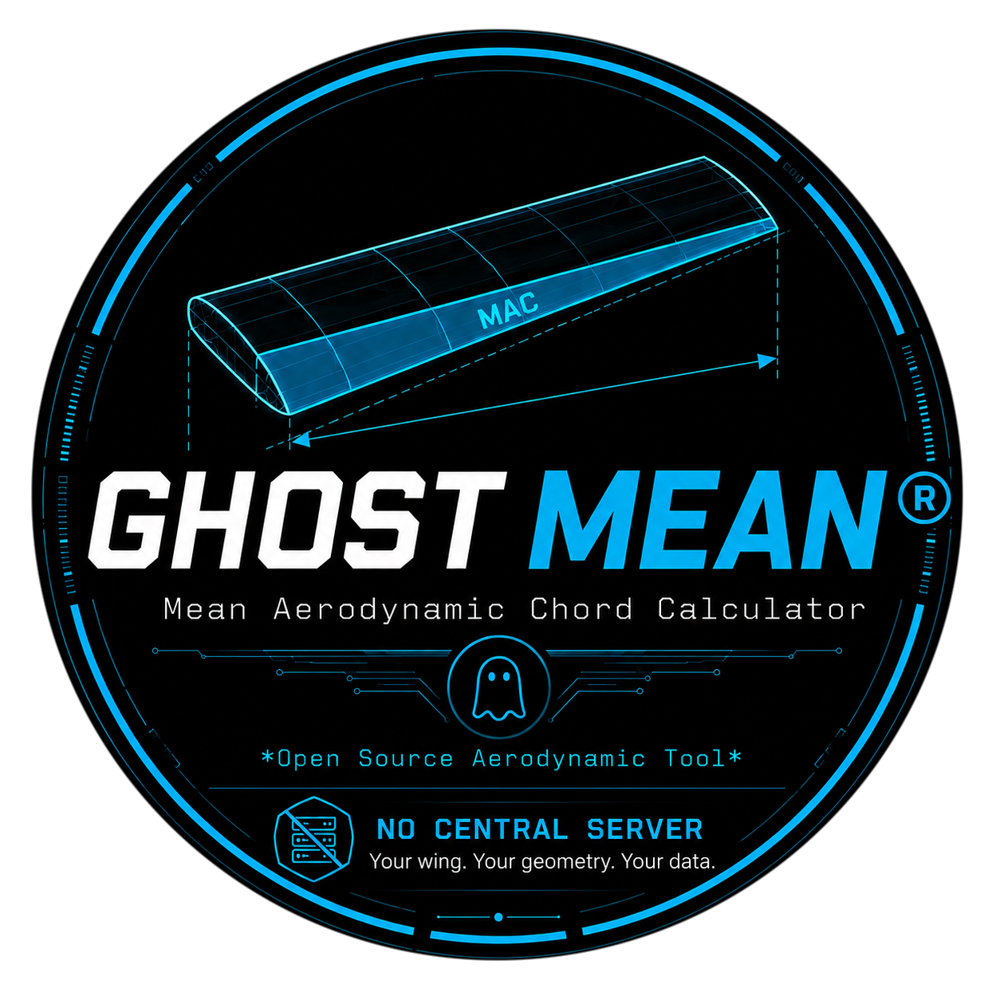

# GhostMEAN — Full Project History

<p align="center">
  
</p>

<p align="center">
  <a href="https://github.com/nftomczain/GhostMEAN/actions"></a>

  
  
</p>

---

<p align="center"><em>🇵🇱 <a href="HISTORY.pl.md">Polska wersja</a> · 🏠 <a href="README.md">Back to README</a></em></p>

Every version, in full detail, from the first prototype to the current
release. For a short overview, see [README.md](README.md); for how to
actually use each feature, see the
[Wiki](https://github.com/nftomczain/GhostMEAN/wiki).

## Changelog

### v1.0.0 — Wiki, real CSV fixtures, README split

- **`docs/wiki/`** — 9 GitHub-Wiki-ready pages (Home, Installation, Quick-Start, Panel-Geometry, Station-View, CSV-Format, Validation, Export-PDF, Troubleshooting). Every fact checked against the actual code, not recalled from memory: verified `CSV_FIELDS`/`STATIONS_CSV_FIELDS`, the large-sweep threshold (60°), the CSV metadata fallback defaults, the 6-language list — and ran `tests/fixtures/test_err.csv` on a live GUI to confirm all six warning types described in the wiki actually fire (including two separate geometry jumps in the same file). The Troubleshooting page is honest about what's unconfirmed: the MIT-SHM workaround (`QT_XCB_NO_MITSHM=1`) is described as matching a known X11 bug class, not as a guaranteed fix — since we're still waiting on user confirmation.
- **Real CSV fixtures from the user**: `tests/fixtures/test.csv` now includes sweep (20°/10°/5°), exactly matching the Quick Start example (verified: sweep doesn't change MAC — still 189.621mm). `tests/fixtures/test2.csv` completely reworked into a continuous 5-panel wing, `320→270→210→160→110→70mm`, with varying sweep — computed and locked in as a regression (MAC=215.681mm, Span=2200mm, Area=422500mm², 6 stations, zero jumps). `tests/fixtures/test_err.csv` updated (fewer panels, one geometry jump instead of two) — all existing assertions passed unmodified. `docs/wiki/CSV-Format.md`'s `test2.csv` description corrected to match.
- **`README.md` / `README.pl.md` rewritten from scratch**, lean: what it is, screenshot, features, installation, quick start, supported languages, tests, download/releases, Wiki, license — nothing else. Down from 420 lines to 120 (EN) / 368 to 122 (PL). **`HISTORY.md` / `HISTORY.pl.md` created** — the complete version-by-version changelog (v0.1.0 onward), moved verbatim from the old README with zero content lost, plus two appendices (Math summary, What's next / deferred roadmap). **`docs/screenshot.png` added** — a real screenshot (the Quick Start 3-panel example, dimensions on) — the README never actually had one before.
- 97/97 tests green throughout.

### v0.4.11 — tests + `--version`

Following the "feature freeze → tests → release" plan: no new features, only hardening what's already there.

- **`ghostmean --version`** — a new `ghostmean` alias (alongside `ghostmean-gui`), both commands handle `--version`/`-v`, print `GhostMEAN <version>` and exit **before touching Qt at all** (works even with no display -- SSH, CI). Version comes from a single source (`ghostmean/__init__.py`), no more manually typing it in several places.
- **A real `pytest` suite** (`tests/`, 97 tests, all green) replacing the ad-hoc one-off scripts used throughout this conversation:
  - `test_geometry.py` (36 tests) — `compute_panel_stations`/`compute_stations`, MAC/Area against a known reference example and against your 250→200→140→80 chain, continuity, a deliberate jump, panels 1–5, negative/zero/large/near-90° sweep, pathological data without a crash.
  - `test_csv.py` (15 tests) — round-trip, canonical mm regardless of display unit, rounding to 6 decimals, a missing column/empty file → a controlled exception, plus `tests/fixtures/test.csv`, `test2.csv`, `test_err.csv` as durable regression fixtures.
  - `test_validation.py` (11 tests) — GUI warnings driven directly by `test_err.csv`, New Project clears warnings.
  - `test_pdf_drawing.py` (19 tests) — PDF for 1–5 panels, a real jump, both units, extreme sweep, no/degenerate data, `draw_wing_plan()` (the renderer shared by screen and PDF) tested separately against a `QPixmap`.
  - `test_i18n.py` (13 tests) — key/placeholder consistency across all 6 languages, plus a **live GUI test** that cycles every language on a real `MainWindow` and checks for no raw, untranslated keys leaking into the interface.
  - `test_version.py` (3 tests) — `pyproject.toml` and `__init__.py` must agree (the exact bug that already happened once), `--version` genuinely works in a truly headless subprocess (no `QT_QPA_PLATFORM`).
- **Clean-checkout build genuinely verified**: copied the whole project into a brand-new directory, confirmed (via a temporary unique version marker) that `python3 -c "import ghostmean"` really reads the local copy, not a globally installed package -- only then ran `./scripts/build_appimage.sh` with no prior `pip install -e .`, matching `git clone → cd → ./scripts/build_appimage.sh` exactly. The resulting file ran correctly.
- `pyproject.toml`: added a `[project.optional-dependencies] test = ["pytest>=7.0"]` group and `[tool.pytest.ini_options]`.

### v0.4.10 — fix: undeclared Pillow dependency

- **`scripts/build_appimage.sh` needed Pillow to resize the icon, but never declared that anywhere** — Pillow happened to be installed in my test environment from earlier, unrelated tasks, so the gap went unnoticed during testing. Reported by the user: `ModuleNotFoundError: No module named 'PIL'` on a clean environment.
- Fixed properly, not patched over: instead of auto-installing Pillow (the way `pyinstaller` is handled), the dependency was removed entirely — icon resizing now goes through `PySide6.QtGui.QImage`, a library the project already requires (declared in `pyproject.toml`). Zero new dependencies.
- Verified for real: uninstalled Pillow from my own environment (`pip uninstall pillow`), confirmed the `ModuleNotFoundError` on import, then ran a full build from scratch — it passes, the icon saves correctly (256×256 PNG RGBA), and the built AppImage still runs.

### v0.4.9 — AppImage

- **`scripts/build_appimage.sh`** — builds a portable, single-file `.AppImage` (PyInstaller onedir → AppDir → appimagetool). No Python/Qt install needed on the machine that runs it.
- Safeguards carried straight over from GhostPoster, before they had a chance to bite here too: always `chmod +x` on `appimagetool` regardless of whether it was freshly downloaded or left over from an interrupted run; an ELF sanity-check before trying to run it (a clear "delete and retry" message instead of a cryptic failure); the bundled `libxkbcommon(-x11).so*` is deleted before packaging so the AppImage falls back to the system's copy (avoids an ABI mismatch against the native X11/Wayland stack).
- **A real bug found on the first run**: PyInstaller 6.x puts shared libraries under a `_internal/` subdirectory (the older `dist/ghostmean/*.so` layout no longer applies) — the first version of `AppRun` didn't account for this and the binary failed to start (`cannot open shared object file`). Fixed and verified by actually running the built AppImage (`--appimage-extract-and-run`, since the build environment has no FUSE).
- Tested from scratch three times: a fresh build, a build with a leftover non-executable `appimagetool` (correctly re-`chmod +x`'d, no unnecessary re-download), and a build with a deliberately corrupted `appimagetool` (correctly detected and re-downloaded).
- `packaging/*.desktop` + `*.metainfo.xml` added for desktop-menu integration; fixed the `.desktop` category (one main category only, no more `appimagetool` warning).

### v0.4.8 — RU, ES, DE, FR

Four more languages, built on a terminology glossary the user supplied.

- **`ghostmean/i18n/ru.py`, `es.py`, `de.py`, `fr.py`** — 117 keys each, checked programmatically against `pl.py` for identical key sets AND identical `{...}` placeholders across all 6 files, zero mismatches. Aviation terminology follows the supplied glossary consistently: `MAC`, `CG`, `LE`, `TE`, `Sweep` stay as technical terms in every language; `Major`/`Minor` stay in English in Russian (matching real-world industry usage), and are translated in Spanish/German/French (`Mayor/Menor`, `Hauptsehne/Endsehne`, `Corde amont/aval`).
- **Station labels are translated too** (`Nasada`→`Корень крыла`/`Raíz`/`Flügelwurzel`/`Emplanture`, etc.) — this required extending `geometry.compute_stations()` with an optional labeling callback (`label_fn`), so geometry.py still doesn't depend on i18n while the UI can inject the translation. Default behavior (no `label_fn`) is 100% identical to before — verified by regression.
- **The station CSV export deliberately stays canonical** (Polish, ASCII-safe labels) regardless of the selected UI language — it's a data-interchange format for building, not a localized artifact (the same principle already used for units in the regular project CSV).
- Tested the PDF in Russian — Cyrillic renders correctly, no font issues.

### v0.4.7 — i18n layer (PL/EN)

All visible interface and PDF-export text now runs through a shared translation layer instead of being hardcoded.

- **`ghostmean/i18n/`**: `pl.py` and `en.py`, each a flat `key → template` dict (112 keys, identical set in both files — checked programmatically). Adding another language means copying `pl.py`, translating the values, and registering it in `LANGUAGES` inside `ghostmean/i18n/__init__.py` — nothing else in the app needs to change.
- **A `Language:` switcher in the top bar** — changes live, no restart, no data loss (verified: MAC, geometry, and CSV round-trip are identical before and after switching).
- Covers the menu, panel labels, tooltips, results, the station table, validation messages, dialogs (New Project, Station View), status bar messages — **and PDF export** (title, results table), which automatically uses whichever language is currently selected.
- **A deliberate scope boundary**: the station labels generated inside `geometry.compute_stations()` (`Nasada`/`Końcówka`/`S1`...) stay Polish for now regardless of the selected language — wiring those into i18n would mean threading a translation into the geometry module, which deliberately has no UI dependency today. Documented directly in the code as a possible next step.

### v0.4.6

- The dimension arrows above the leading edge (`☑ Dimensions on preview`) lost their mm-length text — just the arrow lines remain, visually dividing the panels along the span. The exact length already lives in the legend below the wing (v0.4.2), so it doesn't need repeating above the drawing. Also tightened the top margin (less empty space now that no room is reserved for text there).

### v0.4.5

- Reverted v0.4.4: the `P1`–`P5` tags above the drawing duplicated the separate panel numbering already always shown right next to the wing. Reverted to dimension arrows with the length in mm above the leading edge — one numbering (at the wing), one set of dimensions (above the drawing), no repetition.

### v0.4.4

- The row above the drawing (with `☑ Dimensions on preview` on) now shows simple `P1`–`P5` tags instead of dimension arrows with the length in mm — the exact numbers already live in the readable legend below the wing (v0.4.2), so the top row is reduced to just "what is what", without repeating data.

### v0.4.3 — real scale instead of auto-fit

- **Preview scaling reversed**: previously EVERY wing (small or large) was scaled to fill all available space, so you couldn't visually tell a small wing from a large one. The scale is now fixed (mm-per-pixel), calibrated against a reference "large" wing (2000mm span / 350mm chord depth): a small wing now genuinely looks small (doesn't fill the window), and the bigger it gets beyond the reference, the more tightly it's fit to the available space (so it never overflows the frame). Applies identically to the on-screen preview and the PDF (shared `drawing.py`).
- Along the way, fixed an inaccurate height estimate (was `mac_mm + max_chord`, now the true bounding-box depth computed from the actual station data).
- Geometry, calculations, and the Stations table — untouched; this is purely a rendering change.

### v0.4.2 — dimension renderer polish

Purely typographic — geometry and calculations untouched.

- **Panel labels no longer run together**: instead of a single `Major→Minor | Length | Sweep°` line squeezed below the trailing edge of every panel (which overlapped near the root with 3+ panels), a readable list now appears below the wing — one line per panel, explicitly numbered: `Panel 1:  250→200 | 300mm | 20°`, `Panel 2:  200→140 | 250mm | 10°`, etc. The panel numbers already drawn on the wing unambiguously tie the list to the shape, so there's no need to guess which label belongs to which section.
- **A related side-effect bug fixed along the way**: the top dimension arrows (panel length) could overlap into an unreadable smear of digits with 4-5 short panels side by side. The length label now simply doesn't draw when there's no room for it (the arrow stays) — clean, instead of garbled text.
- The top dimension row (arrows above the leading edge) — unchanged, since it already worked well.

### v0.4.1

- **Scroll for lower resolutions**: the whole window is now wrapped in a `QScrollArea` (vertical and horizontal as needed), so no UI element is ever unreachable on a smaller screen — previously the window had a fixed 1060×1040 size. Verified: at 1024×768 everything (including the `⧉`/`📐` buttons) fits with just a vertical scrollbar; at a more extreme 900×620 a horizontal one also appears, since the panel rows have their own minimum width.
- Visually verified exactly what was asked for: the `📐` dialog for Panel 2 and Panel 3 (using the 250→200→140→80 example with sweep), with confirmed continuity — Panel 3's Y START/LE START exactly match Panel 2's Y END/LE END.

### v0.4.0 — Station View

The first major functional leap since the first version — full panel-station geometry, not just MAC.

- **"Stacje" (Stations) table**: below the preview, one row per panel boundary (Root, S1, S2, ..., Tip) — Y, LE, TE, chord, live in the selected unit.
- **`📐` button on every panel**: THAT panel's exact geometry (Y/LE/TE START and END, CHORD START and END, SWEEP) in its own window — exactly what's needed when building the physical wing from a computed plan. Verified against the user's own worked chain example (250→200→140→80 at lengths 300/250/200mm) — the station table shows Y=0/300/550/750mm and chords 250/200/140/80mm, matching the previously-given table exactly.
- **Dimension arrows on the preview**: `☑ Dimensions on preview` now also draws an arrow with the panel's length above the leading edge (not just the text label below the trailing edge from v0.3.2).
- **Export stations (CSV)**: a second, independent file format (`station,y_mm,le_x_mm,te_x_mm,chord_mm`) — resolved geometry for building, not a project file meant to be reloaded.
- **A real bug found (and properly fixed) while building this feature** (not just a Station View issue): the MAC/Area engine (`compute_wing_metrics`) always used each panel's OWN `Major` independently, but the drawing/station table had, since the very first version, silently assumed continuity (joining panels via the previous one's `Minor`, ignoring the current panel's `Major` when they didn't match) — so MAC and the drawing could show two different wings. This never surfaced before because every earlier example maintained continuity. **Fixed properly, not just with a warning**: `geometry.compute_panel_stations()` now computes each panel from its own data (a single source of truth for both the engine and the drawing), and `geometry.compute_stations()` detects a mismatch and inserts an extra geometry point — a real, visible step in the trailing edge, identical on screen, in the station table, and in the PDF. The warning (`Major ≠ previous panel's Minor`) stays, but it no longer hides or smooths anything.
- Deliberately out of scope for this version (per the plan): DXF/SVG, airfoil/profile, twist, flaperons, asymmetric wings, 3D.

### v0.3.3 — bugs found by CSV testing

- **`Length ≤ 0` was undetectable**: the `Length` field had a `(0.01, 10000)` range, so `QDoubleSpinBox` automatically raised any value ≤0 (e.g. `0.0` from a CSV) to `0.01` before any validation ran — the warning never fired. Fixed: range changed to `(0, 10000)`, matching `Major`/`Minor`, which already allowed 0 and relied on validation rather than clamping. Verified against the exact reported case (a CSV with `Length=0.000000`) — now correctly shows `Panel N: Length ≤ 0`, with no impact on calculation/PDF stability.
- **The "Dimensions on preview" checkbox was invisible**: the global style that hides the native `QCheckBox` indicator (see v0.1.3) applies to EVERY checkbox in the app, but only panel-row checkboxes had their own compensation (a text-based ✓/✗ marker). This checkbox didn't — it was fully clickable (confirmed) but had no visible state at all. Fixed systemically: a shared `style_toggle_checkbox()` helper is now used by every checkbox in the app, so this bug class can't recur when new toggles are added later.

### v0.3.2 — Quality of Life

- **Geometry validation** (non-blocking): warnings below the panel table when `Major ≤ 0`, `Minor ≤ 0`, `Length ≤ 0`, `Minor > Major` (unusual taper), or a sweep >60° (worth double-checking). The calculation keeps working regardless — it's only a signal. Verified that pathological/invalid data (0, 0, 0.01mm, 89°) never crashes the app.
- **Dimensions on preview**: new `☑ Dimensions on preview` checkbox — a `Major→Minor | Length | Sweep°` label appears below each panel's trailing edge, useful when matching the model against a photo or plan. Labels are measured dynamically and clamped to the visible area so they don't get clipped near the edges.
- **Panel copy**: a `⧉` button on every panel (except the last) copies it into the next one — the current panel's `Minor` becomes the next panel's `Major` (chord continuity preserved), the rest is copied as a starting point, and the next panel is auto-enabled. Lets you build a multi-panel wing without retyping shared values.
- **File → New Project** (Ctrl+N): with a confirmation prompt, resets all 5 panels, `CG — custom %`, and the unit back to their initial state.
- **Last directory remembered**: `Ctrl+O` and the save/export dialogs now default to wherever you last worked.
- CG (25/28/30/custom) — unchanged, as planned.

### v0.3.1

- Renamed the `CG (CUSTOM %)` result label from the earlier "own %"
  wording (and likewise in the PDF) — the old wording implied the user
  had supplied that exact point, when it's really just an extra,
  adjustable percentage level. The input field itself (`CG — custom %:`)
  was left unchanged, since that one genuinely is user-entered.

### v0.3.0

- **Sweep — definition explicitly locked** (confirmed and verified with
  geometric tests): the LEADING-EDGE (LE) sweep of a given panel,
  measured from the global spanwise axis, ABSOLUTELY and independently
  per panel (no accumulation relative to the previous panel). `0°` = LE
  parallel to the spanwise axis. The chord stays perpendicular to the
  global spanwise axis — sweep only offsets the LE sideways. Documented
  directly in `geometry.py` (module docstring) and in the "Sweep (LE)"
  field tooltip in the GUI.
- **CG instead of a single AC**: `% MAC for AC` replaced by
  `CG — custom %` plus three fixed results **CG 25% / CG 28% / CG 30%**
  and **CG (custom %)** — each shown as the distance from the leading
  edge measured at the MAC station (exactly what you'd measure with a
  ruler on the wing).
- **MAC POSITION** now shows both X and Y (X = leading-edge position of
  the MAC from the root) — useful for your own CG calculations.
- **Expanded preview**: symmetry axis (dashed center line), panel
  numbering (1, 2, ... on each panel, both sides), a total-span dimension
  line below the wing, and 4 CG markers (25/28/30/custom%) on the MAC
  line with clear, de-overlapped labels (leader lines connect each label
  to its exact marker so closely-spaced percentages don't run together).
- Geometry drawing is still 100% shared between the screen and the PDF
  (`drawing.py`), so the PDF export has the same elements (symmetry axis,
  panel numbers, dimension, CG markers) in printable form.

### v0.2.1

- Unambiguously defined `Sweep`: the LEADING-EDGE (LE) sweep of a given
  panel, measured from the spanwise axis, independently per panel (not
  relative to the previous panel); the chord does not rotate — sweep only
  offsets the LE sideways. UI label changed to `Sweep (LE):`, full
  explanation in the tooltip.
- `MAC POSITION` results now also show `X` (leading-edge position of the
  MAC from the root), not just `Y` — useful for CG calculations.

### v0.2.0

- **Save data (CSV)** / **Load data (CSV)** (File menu, Ctrl+S / Ctrl+O):
  saves all 5 panels (including disabled ones, so nothing gets lost),
  the %MAC for AC, and the unit. Data is stored canonically in mm
  regardless of the currently selected GUI unit, so the file is
  portable; the display unit is also remembered and restored. Verified
  with a full round-trip (save → reset the GUI → load → identical values
  and identical M.A.C. result).
- **Export PDF (model)** (File menu, Ctrl+P): a printable A4 sheet
  (light background, dark ink — independent of the app's dark on-screen
  theme) with the top-down wing plan (same geometry as the on-screen
  preview, shared `drawing.py` module) and a results table.
- The filename is remembered between a CSV save and a PDF export — after
  saving `wing.csv`, the PDF save dialog defaults to `wing.pdf`, so names
  stay consistent.

### v0.1.3

- The panel checkbox had an invisible native indicator on the dark
  theme — replaced with a clear text-based marker instead: `✓ Panel N`
  (blue, bold) when enabled, `✗ Panel N` (red, bold) when disabled; the
  native box is hidden (`QCheckBox::indicator { width: 0; height: 0; }`)
  so it doesn't duplicate the text marker.

### v0.1.2

- Fixed the misleading impression that panels 2–5 "don't work": the
  logic was correct (the checkbox did enable the fields), but disabled
  fields looked nearly identical to enabled ones, so typing without
  first checking the checkbox looked like nothing happened — added a
  clear `:disabled` style (dimmed background/text) plus a tooltip
  explaining to check the "Panel N" checkbox first.

### v0.1.1

- The wing preview now uses the full available panel height (previously
  it kept to a fixed minimum, leaving empty space).
- Label renamed to `Length` in the panel row.
- Results redesigned in a "Ghost" style: uppercase captions, monospace
  values, `MAC POSITION` (Y) and `AERODYNAMIC CENTER` (X, Y) on separate,
  readable lines.
- Verified against a real two-panel wing (different chords and sweep per
  panel) — MAC/MAC position/AC results match a manual recomputation of
  the formulas to 3–4 decimal places; the calculations (`geometry.py`)
  were left unchanged.

### v0.1.0 — first version

- Up to 5 wing panels (each: enable/disable, Major Chord, Minor Chord,
  Panel Length, Sweep +/−).
- mm or inch units (switchable live, values converted).
- Automatically computed:
  - Wing Span
  - Area
  - Aspect Ratio
  - M.A.C. (Mean Aerodynamic Chord) — computed by **integrating the true
    chord distribution**, not just the single-trapezoid formula, so
    multi-panel wings with different taper per panel are handled
    correctly.
  - MAC position (spanwise and chordwise)
  - Aerodynamic Center at a given %MAC (25% by default)
- Graphical top-down wing preview (both halves, MAC line, AC marker).

## Appendix: Math (summary)

For a panel with root chord `Cr`, tip chord `Ct`, and length `L`:

```
panel_MAC = (2/3) * Cr * (1+λ+λ²)/(1+λ),   λ = Ct/Cr
```

For the whole (multi-panel) wing, `MAC` and its position are computed by
integrating `c(y)²` and `c(y)·y` over the span — see the comment in
`ghostmean/geometry.py`. Verified against a known reference example
(11"/6" → MAC≈8.745") and against the rectangular-wing case (MAC =
constant chord).


## Appendix: What's next (deferred until after v1.0)

- **v0.5.0 — DXF/SVG import** (deliberately deferred — a much harder problem than CSV save/load, requiring recognition of the symmetry axis and panel boundaries from an arbitrary drawing).
- **v0.6.0 — airfoil/profile**
- Left/right half symmetry — currently always symmetric (a deliberate decision, see the v0.3.0 changelog entry); separate left/right panels would be a bigger future rebuild.
- Flatpak packaging (AppImage is already done, see above).
